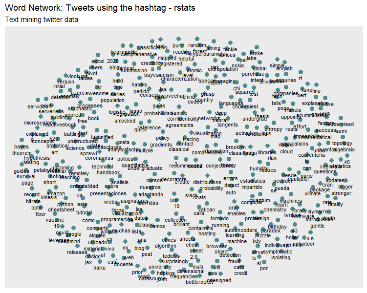
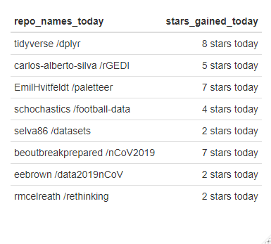
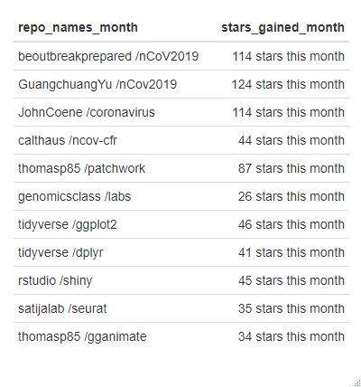
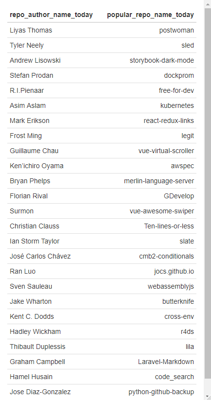

# R-Community-Exploration
================

Meet Bhatnagar <br>
December, 2019 - Present <br>

[](https://github.com/rstats-gsoc/gsoc2021/wiki/R-Community-Explorer%3A-Twitter)

## Details of coding project

### A. Dashboard Visualization

Package dependencies : *rtweet*, *flexdashboard*, *lubridate*, *anytime*, *dplyr*, *plotly*, *leaflet*, *DT*, *crosstalk* <br>

Twitter dashboard analysis: https://meetdarkpow.github.io/RCE-sample-dashboard/rstats_sample_dashboard.html <br>
R Events dashboard analysis: https://meetdarkpow.github.io/RConf-sample-dashboard/rconf_sample_dashboard.html

### B. Twitter Exploration

Package Dependencies : *rtweet*, *tidytext*, *ggplot2*, *dplyr*, *igraph*, *ggraph*, *widyr*, *tidyr*. <br>

**All of the Twitter Exploration till now has been divided into Five Sections**

* Searching and text mining twitter data
* Statistics for tweets between specified dates
* Twitter users - unique locations
* Count of unique words found in tweets
* Word network of tweets - Paired Word Analysis

Let's see a detailed view of these following sections :-

#### **Searching and text mining twitter data**

```
install.packages("rtweet")

library(rtweet)

# searching for #rstats tweets 
rstats_tweets <- search_tweets(q="#rstats", retryonratelimit = T)
head(rstats_tweets)

# cleaning tweets
# storing a cleaned tweet in a separate column named "stripped_text"
rstats_tweets$stripped_text <- gsub("http.*","",rstats_tweets$text) 
rstats_tweets$stripped_text <- gsub("https.*","",rstats_tweets$stripped_text)
rstats_tweets$stripped_text <- gsub("#.*","",rstats_tweets$stripped_text)
rstats_tweets$stripped_text <- gsub("@.*","",rstats_tweets$stripped_text)
```

#### **Statistics for tweets between specific dates**

This section gives us an insight for getting the number of #rstats tweets between specified dates.

```
install.packages("ggplot2")

library(ggplot2)

# past tweets date
rt <- as.Date(rstats_tweets$created_at)

# daily number of tweets
daily <- as.Date("2020-02-11")
daily_number_tweets <- sum(rt == daily, na.rm = TRUE)

# tweets between specific dates
since <- as.Date("2020-02-10")
until <- as.Date("2020-02-15")
weekend <- as.Date(since:until, origin="1970-01-01")
weekly_number_tweets <- c()
for(i in 1:length(weekend)){
  weekly_number_tweets <- c(weekly_number_tweets, sum(rt == weekend[i], na.rm = TRUE))
}
weekly_frame <- data.frame(weekend, weekly_number_tweets)

# ploting 
weekly_plot <- ggplot(data=weekly_frame, aes(x=weekend, y=weekly_number_tweets, group=1)) +
  geom_line(linetype="dashed", color="blue", size=1.2)+
  geom_point(color="red", size=3) +
  ggtitle("#rstats tweets between 2020-02-10 and 2020-02-15") +
  theme(axis.text.x=element_text(angle=45, hjust=1))+
  xlab("Days") + ylab("Number of Tweets")
```
Output plot: <br>
 <br>

#### **Twitter users - unique locations**

Getting an idea of locations from where the most #rstats tweets were made from different locations of the world.

```
install.packages("rtweet")
install.packages("ggplot2")

library(rtweet)
library(ggplot2)

# Name of account from where tweets were from
head(rstats_tweets$screen_name)
unique(rstats_tweets$screen_name)

# location from where tweets were from
users <- search_users("#rstats", n=500)

length(unique(users$location))

# ploting Twitter users - Unique Locations
users %>%
  ggplot(aes(location)) +
  geom_bar() + coord_flip() +
  labs(x = "Count",
       y = "Location",
       title = "Twitter users - Unique Locations ")

# ploting Twitter user's for tweeting #rstats in top 50 unique locations
users %>%
  count(location, sort = TRUE) %>%
  mutate(location = reorder(location,n)) %>%
  na.omit() %>%
  top_n(50) %>%
  ggplot(aes(x = location,y = n)) +
  geom_col() +
  coord_flip() +
  labs(x = "Location",
       y = "Count",
       title = "Twitter user's for tweeting #rstats in top 50 unique locations ")
```
Output Plots: <br>
(i) Twitter users - Unique Locations: <br>
 <br>
(ii) Twitter user's for tweeting #rstats in top 50 unique locations: <br>
 <br>

#### **Count of unique words found in tweets** 

Taking the count of most unique words which were most frequently used in #rstats tweets by the users.

```
install.packages("rtweet")
install.packages("ggplot2")
install.packages("dplyr")
install.packages("tidytext")
install.packages("igraph")
install.packages("ggraph")

library(rtweet)   
library(ggplot2) 
library(dplyr)
library(tidytext) 
library(igraph)   
library(ggraph)

# selecting clean text
rstats_tweets_clean <- rstats_tweets %>%
  select(stripped_text) %>%
  unnest_tokens(word, stripped_text)

# ploting Count of unique words in tweets {Stop words present}
rstats_tweets_clean %>%
  count(word, sort = TRUE) %>%
  top_n(15) %>%
  mutate(word = reorder(word, n)) %>%
  ggplot(aes(x=word, y=n)) + 
  geom_col() +
  xlab(NULL)+
  coord_flip() +
  labs(x="count",
       y= "Unique words",
       title = "Count of unique words in tweets")

# searching what are stop_words 
data("stop_words")
head(stop_words)

# number of rows, text has before removal of stop words
nrow(rstats_tweets_clean)

# removing stop words
rstats_tweet_words <- rstats_tweets_clean %>%
  anti_join(stop_words)
 
# number of rows, text has after removal of stop words
nrow(rstats_tweet_words)

# WE CAN LITERALLY SEE THE DIFFERENCE IN NUMBER OF ROWS

# ploting Count of unique words in tweets {Stop words removed}
rstats_tweet_words %>%
  count(word, sort = TRUE) %>%
  top_n(15) %>%
  mutate(word = reorder(word, n)) %>%
  ggplot(aes(x = word, y = n)) +
  geom_col() +
  xlab(NULL) +
  coord_flip() +
  labs(y = "Count",
       x = "Unique words",
       title = "Count of unique words found in tweets",
       subtitle = "Stop words removed from the list")
```
Output Plots: <br>
(i) Count of unique words in tweets {Stop words present}: <br>
 <br>
(ii) Count of unique words found in tweets {Stop words removed}: <br>
 <br>


#### **Word network of tweets - Paired Word Analysis**

The tweets text is studied and most frequently 2 words used together are collected with their respective word frequency. These words do include stop-words too. So, for the proper study we have to remove the stop-words from the tweets text. Therefore, after removing the stop-words we get a proper information of 2 words used together. An output word network can be created of these words displayed as below.

```
install.packages("widyr")
install.packages("tidyr")

library(widyr)
library(tidyr)

# forming pair-words
rstats_tweets_paired_words <- rstats_tweets %>%
  dplyr::select(stripped_text) %>%
  unnest_tokens(paired_words, stripped_text, token = "ngrams", n = 2)
# count of pair-words
rstats_tweets_paired_words %>%
  count(paired_words, sort = TRUE)

# separating pair-words into 2 columns
rstats_tweets_separated_words <- rstats_tweets_paired_words %>%
  separate(paired_words, c("word1", "word2"), sep = " ")

rstats_tweets_filtered <- rstats_tweets_separated_words %>%
  filter(!word1 %in% stop_words$word) %>%
  filter(!word2 %in% stop_words$word)

rstats_words_counts <- rstats_tweets_filtered %>%
  count(word1, word2, sort = TRUE)
head(rstats_words_counts)

# ploting word network for #rstats
rstats_words_counts %>%
  filter(n >= 30) %>%
  graph_from_data_frame() %>%
  ggraph(layout = "fr") +
  geom_node_point(color = "darkslategray4", size = 3) +
  geom_node_text(aes(label = name), vjust = 1.8, size = 3) +
  labs(title = "Word Network: Tweets using the hashtag - rstats",
     subtitle = "Text mining twitter data ",
       x = "", y = "")
```
Output plot: <br>
 <br>

### C. CRAN Exploration

Package Dependencies : *rvest*, *installr*, *ggplot2*, *data.table*, *cranlogs*, *lubridate*, *magrittr*, *tm*, *wordcloud*, *RColorBrewer*, *SnowballC*, *miniCRAN*, *igraph*, *cowplot*, *NLP*, *xml2*. <br>

**All of the CRAN Exploration till now has been divided into Ten Sections**

* Web scraping - Names of packages and respective summary 
* Analysis of package statistics - Short duration data
* Analysis of package statistics - Yearly data
* Most popular package - last-day, last-week, last-month
* Statistics - R software downloaded
* Statistics - R version downloaded
* Most dependent upon packages
* Word-cloud of popular package keywords
* Popular package authors
* Network-graph of package dependencies

Let's see a detailed view of these following sections :-

#### **Web scraping - Names of packages and respective summary**

Here's my idea: We know that, whenever a new package is added to R CRAN package list it will be available on the website (i.e https://cran.r-project.org/web/packages/). So we can directly web scrap the package name and their respective summary from this site. This results in our package list to be always updated. 
Presently we get a total of 15,389 packages available.

```
install.packages("rvest")
install.packages("xml2")

library(rvest)
library(xml2)

CRAN_package_wbpg <- read_html("https://cran.r-project.org/web/packages/available_packages_by_name.html")
  
# storing and cleaning package names
package_names <- CRAN_package_wbpg %>%
  html_nodes("a") %>%
  html_text()
package_names <- package_names[!package_names %in% LETTERS]

# storing and cleaning package summary
package_summary <- CRAN_package_wbpg %>%
  html_nodes("td+ td") %>%
  html_text()
package_summary <- gsub("[\r\n]", "", package_summary)
  
# creating a data frame 
CRAN_package_data <- data.frame(
  Name = package_names, Summary = package_summary)
```
Output Image: <br>
 <br>

#### **Analysis of package statistics - Short duration data**

In this section we can study the day to day top package downloads from CRAN. The line plot using the function lineplot_package_downloads() produces a multiple time series plot for the top six packages. The bar plot is used to compare any two packages together for number of download analysis.

```
install.packages("installr")
install.packages("ggplot2")
install.packages("data.table")
install.packages("plyr")

library(installr)
library(ggplot2)
library(data.table)
library(plyr)

# set your working directory and package stats file will be stored in folder "Logs"
dir.create("Logs")
RStudio_CRAN_dir <- download_RStudio_CRAN_data(START = '2020-01-01',END = '2020-01-10', log_folder="Logs")

RStudio_CRAN_data <- read_RStudio_CRAN_data(RStudio_CRAN_dir)

dim(RStudio_CRAN_data)

# creating most downloaded package list
pkg_list <- most_downloaded_packages(RStudio_CRAN_data)
pkg_list

lineplot_package_downloads(names(pkg_list),RStudio_CRAN_data)

# bar plot for day to day package download stats comparison for "ggplot" and "Rcpp"
par(mfrow=c(1,2))
barplot_package_users_per_day("ggplot",RStudio_CRAN_data)
barplot_package_users_per_day("Rcpp", RStudio_CRAN_data)
```
Output Plots: <br>
(i) Line plot for top six package downloads from '2020-01-01' till '2020-01-10': <br>
 <br>
(ii) Bar plot for day to day package download statistics for "ggplot" and "Rcpp": <br>
 <br>

#### **Analysis of package statistics - Yearly data**

Here we have used {cranlogs} package to retrieve the data from the RStudio CRAN mirror. This section generates two graph plots based on week and month analysis.

```
install.packages("cranlogs")
install.packages("data.table")
install.packages("lubridate")
install.packages("ggplot2")
install.packages("magrittr")

library(cranlogs)
library(data.table)
library(lubridate)
library(ggplot2)
library(magrittr)

# assigned a certain time period
total_downld <- cran_downloads(from = "2019-01-01", to = "2019-12-31")
# setting mode to data.table
setDT(total_downld)
# converting the date to week and month format
total_downld[, `:=`(
  round_week = floor_date(date, "week"),
  round_month = floor_date(date, "month")
)]

# total downloads
total_downld[, .(total =sum(count))]

# creating a random color generator for graph plot
random_col <- function(n){
  sample(viridis::viridis(100), n)
}

# Weekly download analysis 
total_downld[, .(count = sum(count)), round_week] %>%
  ggplot(aes(round_week, count)) + 
  geom_col(fill = random_col(1)) + 
  labs(
    title = "Packages downloads by Week on RStudio CRAN mirror", 
    subtitle = "data via {cranlogs}", 
    x = "Week classification", y="Number of downloads"
  ) + 
  theme_minimal()

# Monthly download analysis 
total_downld[, .(count = sum(count)), round_month] %>%
  ggplot(aes(round_month, count)) + 
  geom_col(fill = random_col(1)) + 
  labs(
    title = "Packages downloads by Month on RStudio CRAN mirror", 
    subtitle = "data via {cranlogs}", 
    x = "Month classification", y="Number of downloads"
  ) + 
  theme_minimal()
```
Output Plots: <br>
(i) Weekly package download analysis from '2019-01-01' till '2019-12-31': <br>
 <br>
(ii) Monthly package download analysis from '2019-01-01' till '2019-12-31': <br>
 <br>

#### **Most popular package - last-day, last-week, last-month** 

```
install.packages("cranlogs")
install.packages("cowplot")

library(cranlogs)
library(cowplot)

# storing number of download's for packages in last-day, last-week, last-month
mp_pkg_day <- cran_top_downloads(when = "last-day", count = 10)
mp_pkg_week <- cran_top_downloads(when = "last-week", count = 10)
mp_pkg_month <- cran_top_downloads(when = "last-month", count = 10)

# last-day plot
day_plot <- ggplot(data=mp_pkg_day, aes(x=package, y=count)) +
  geom_bar(stat="identity", fill="steelblue")+
  geom_text(aes(label=count), vjust=1.6, color="white", size=3.5)+
  theme_minimal()+
  theme(axis.text.x=element_text(angle=45, hjust=1))+
  labs(title = "Most popular packages downloaded on last day",
        x = "Packages", y = "Number of downloads")

# last-week plot
week_plot <- ggplot(data=mp_pkg_week, aes(x=package, y=count)) +
  geom_bar(stat="identity", fill="#999999")+
  geom_text(aes(label=count), vjust=1.6, color="white", size=3.5)+
  theme_minimal()+
  theme(axis.text.x=element_text(angle=45, hjust=1))+
  labs(title = "Most popular packages downloaded on last week",
       x = "Packages", y = "Number of downloads")

# last-month plot
month_plot <- ggplot(data=mp_pkg_month, aes(x=package, y=count)) +
  geom_bar(stat="identity", fill="#E69F00")+
  geom_text(aes(label=count), vjust=1.6, color="white", size=3.5)+
  theme_minimal()+
  theme(axis.text.x=element_text(angle=45, hjust=1))+
  labs(title = "Most popular packages downloaded on last month",
       x = "Packages", y = "Number of downloads")

# plotting graph together using library "cowplot" 
plot_grid(day_plot, week_plot, month_plot, labels = "AUTO")
```
Output plot: <br>
 <br>

#### **Statistics - R software downloaded**

This section will provide a look at the number of downloads for R.

```
install.packages("cranlogs")
install.packages("data.table")
install.packages("lubridate")
install.packages("ggplot2")
install.packages("magrittr")

library(cranlogs)
library(data.table)
library(lubridate)
library(ggplot2)
library(magrittr)

# assigned a certain time period
total_R <- cran_downloads("R", from = "2019-01-01", to = "2019-12-31")
# setting mode to data.table
setDT(total_R)
# converting the date to week and month format
total_R[, `:=`(
  round_week_r = floor_date(date, "week" ),
  round_month_r = floor_date(date, "month" )
) ]

# total downloads
total_R[, .(total = sum(count))]

# Weekly download analysis 
total_R[, .(count = sum(count)), round_week_r] %>%
  ggplot(aes(round_week_r, count)) + 
  geom_col(fill = random_col(1)) + 
  labs(
    title = "R downloads by Week on RStudio CRAN mirror", 
    subtitle = "data via {cranlogs}", 
    x = "Week classification", y="Number of downloads"
  ) + 
  theme_minimal()

# Monthly download analysis 
total_R[, .(count = sum(count)), round_month_r] %>%
  ggplot(aes(round_month_r, count)) + 
  geom_col(fill = random_col(1)) + 
  labs(
    title = "R downloads by Month on RStudio CRAN mirror", 
    subtitle = "data via {cranlogs}", 
    x = "Month classification", y="Number of downloads"
  ) + 
  theme_minimal()
```
Output Plots: <br>
(i) Weekly package download analysis from '2019-01-01' till '2019-12-31': <br>
 <br>
(ii) Monthly package download analysis from '2019-01-01' till '2019-12-31': <br>
 <br>

#### **Statistics - R version downloaded**

Let’s have a look to the number of download by R version:

```
install.packages("cranlogs")
install.packages("data.table")
install.packages("lubridate")
install.packages("ggplot2")
install.packages("magrittr")

library(cranlogs)
library(data.table)
library(lubridate)
library(ggplot2)
library(magrittr)

# R version plot analysis
total_R[, .(count = sum(count)), version][order(count, decreasing = TRUE)] %>%
  head(10) %>% 
  ggplot(aes(reorder(version, count), count)) +
  coord_flip() +
  geom_col(fill = random_col(1)) + 
  labs(
    title = "10 most downloaded R versions in 2019 on RStudio CRAN mirror", 
    subtitle = "data via {cranlogs}", 
    x = "version", y="Number of downloads"
  ) + 
  theme_minimal()
```
Output plot: <br>
 <br>

#### **Most dependent upon packages**

This information can be found out by using the `available.packages()` function, which gives the information of packages in matrix class. In which can create a separate data frame which contains the following columns: Package Name, Depends, Suggests.

Output table:<br>
 <br>

#### **Word-cloud of popular package keywords**

Text mining methods allow us to highlight the most frequently used keywords in a paragraph of texts. One can create a word cloud, also referred as text cloud or tag cloud, which is a visual representation of text data.

```
install.packages("NLP")
install.packages("tm")
install.packages("wordcloud")
install.packages("RColorBrewer")
install.packages("SnowballC")

library(NLP)
library(tm)
library(wordcloud)
library(RColorBrewer)
library(SnowballC)

# converting data to string
data <- toString(package_summary)
data <- gsub('[[:punct:] ]+',' ',data)

# cleaning data
docs <- VCorpus(VectorSource(data))
docs <- tm_map(docs, content_transformer(tolower))
docs <- tm_map(docs, removeNumbers)
docs <- tm_map(docs, removeWords, stopwords("english"))
docs <- tm_map(docs, removePunctuation)
docs <- tm_map(docs, stripWhitespace)
docs <- tm_map(docs, PlainTextDocument)

# creating a matrix for tabulation of word with respective frequency 
dtm <- TermDocumentMatrix(docs)
m <- as.matrix(dtm)
v <- sort(rowSums(m),decreasing=TRUE)
d <- data.frame(word = names(v),freq=v)
head(d, 10)

# plotiing word-cloud
set.seed(1234)
wordcloud(words = d$word, freq = d$freq, min.freq = 1,
          max.words=550, random.order=FALSE, rot.per=0.35, 
          colors=rev(colorRampPalette(brewer.pal(9,"Blues"))(32)[seq(8,32,6)]))
```
Output plot:<br>
 <br>

#### **Popular package authors**

This information can be retrieved by using the `cranlogs` library, on the basis of number of downloads. The author network plot can be drawn in which one can view how the different authors (i.e. nodes) are connected to one another via edges. This is an interactive way viewing authors involvement with different packages. Sample author taken is “Bob Rudis” displays 176 collaborators in 47 packages.

```
# popular authors
library(tools)
library(cranly)

p_db <- tools::CRAN_package_db()
clean_p_db <- clean_CRAN_db(p_db)
author_net <- build_network(object = clean_p_db, perspective = "author")
plot(author_net, author = "Bob Rudis", exact = FALSE)

author_summary <- summary(author_net)
plot(author_summary)
```
Output network: <br>
 <br>

A bar plot can be drawn using command: `plot(summary(author_net))`. This plot is also helpful to know who the most specific CRAN package authors are.

Output plot: <br>
 <br>

#### **Network-graph of package dependencies**

In this section, we will view an example for package dependencies for these 3 packages:
* "data.table"
* "chron"
* "plyr"

```
install.packages("miniCRAN")
install.packages("igraph")

library(miniCRAN)
library(igraph)

# retrieving the available packages on CRAN
pkgdata <- pkgAvail(repos = c(CRAN="http://cran.revolutionanalytics.com"), type="source")
head(pkgdata[, c("Depends", "Suggests")])

# packages to check dependencies on
tags <- c("data.table", "chron", "plyr")

# plotting network graph
set.seed(50)
plot(makeDepGraph(tags, includeBasePkgs=FALSE, suggests=TRUE, enhances=TRUE), 
     legendPosEdge = c(-1, 1), legendPosVertex = c(1, 1), vertex.size=9)
```
Output plot:<br>
 <br>

### D. GitHub Exploration

Package Dependencies : *httr*, *jsonlite*, *ggplot2*, *cowplot*, *xml2*, *rvest*, *stringr*, *formattable*. <br>

**All of the GitHub Exploration till now has been divided into Four Sections**

* Extracting GitHub API data using R
* Most popular R - Repositories
* Trending repos per day/week/month
* Trending developers per day/week/month

Let's see a detailed view of these following sections :-

#### **Extracting GitHub API data using R**

APIs are the driving force behind data mash-ups. It is APIs that allow machines to access data programmatically – that is automatically from within a program – to make use of API provided functionalities and data. Searching for the R-repositories and arranging them in descending order on the basis of number of stars. 

This patch of code results in the creation of a data frame (“Rrepos_df”). Containing the information about the top 10 most starred repos on GitHub along with their respective Star_count, Fork_count and Open_issue_count.

```
install.packages("httr")
install.packages("jsonlite")

library(httr)
library(jsonlite)

# turning off the feature of R to turn multinomial variables,
# dummy variables in regression models and produce nice cross tables.
options(stringsAsFactors = FALSE)

url <- "https://api.github.com"
path <- "search/repositories?q=language:R&per_page=100&sort=stars&order=desc"

# getting data
raw.result <- GET(url = url, path = path)
# checking status code for extracting data
raw.result$status_code
# raw data
this.raw.content <- rawToChar(raw.result$content)
# creating "list" from JSON file
this.content <- fromJSON(this.raw.content)
class(this.content)
# Most starred repos
repos_names <- this.content[["items"]][["name"]]
Star_count <- this.content[["items"]][["stargazers_count"]]
# Most forked repos
Fork_count <- this.content[["items"]][["forks_count"]]
# Most open_issues repos
Openissue_count <- this.content[["items"]][["open_issues_count"]]

# creating data-frame 
Rrepos_df <- data.frame(Repository = repos_names[1:10],
                 Star = Star_count[1:10],
                 Fork = Fork_count[1:10],
                 Open_Issue = Openissue_count[1:10])
```
Output Image: <br>
 <br>

#### **Most popular R - Repositories**

Representing the top 10 repositories with most number of stars, forks and open issues count in all of R repositories on GitHub.

```
install.packages("ggplot2")
install.packages("cowplot")

library(ggplot2)
library(cowplot)

# plotting number of stars per repositories
star_plot <- ggplot(data=Rrepos_df, aes(x=Repository, y=Star)) +
  geom_bar(stat="identity", fill="steelblue")+
  geom_text(aes(label=Star), vjust=1.6, color="white", size=3.5)+
  theme_minimal()+
  theme(axis.text.x=element_text(angle=45, hjust=1))+
  labs(title = "Top 10 repositories with most number of stars",
       x = "Repositories", y = "Number of Stars")

# plotting number of forks per repositories
fork_plot <- ggplot(data=Rrepos_df, aes(x=Repository, y=Fork)) +
  geom_bar(stat="identity", fill="darkred")+
  geom_text(aes(label=Fork), vjust=1.6, color="white", size=3.5)+
  theme_minimal()+
  theme(axis.text.x=element_text(angle=45, hjust=1))+
  labs(title = "Top 10 repositories with most forks",
       x = "Repositories", y = "Number of Forked")

# plotting number of open issues per repositories
open_issues_plot <- ggplot(data=Rrepos_df, aes(x=Repository, y=Open_Issue)) +
  geom_bar(stat="identity", fill="darkgreen")+
  geom_text(aes(label=Open_Issue), vjust=1.2, color="white", size=3)+
  theme_minimal()+
  theme(axis.text.x=element_text(angle=45, hjust=1))+
  labs(title = "Top 10 repositories with most open issues",
       x = "Repositories", y = "Number of Open Issues")

# plotting three plots together
plot_grid(star_plot, fork_plot, open_issues_plot, labels = "AUTO")
```
Output Image: <br>
 <br>

#### **Trending repos per day/week/month**

The trending R repos are extracted from the GitHub page by web scrapping done using R. The repo_name and their stars_gained are extracted and text mined, cleaned to remove any white spaces. The required information of trending repos is displayed in table format using `formattable()` function under formattable library. Sample table is created/searched for the date of 19th March, 2020.

```
install.packages("xml2")
install.packages("rvest")
install.packages("formattable")

library(xml2)
library(rvest)
library(formattable)

# today
r_trending_repos_today_wbpg <- read_html("https://github.com/trending/r?since=daily")

repo_names_today <- r_trending_repos_today_wbpg %>%
  html_nodes(".h3 a") %>%
  html_text()
repo_names_today <- gsub("(?<=[\\s])\\s*|[\r\n]|^\\s+|\\s+$", "", repo_names_today, perl=TRUE)

stars_gained_today <- r_trending_repos_today_wbpg %>%
  html_nodes(".float-sm-right") %>%
  html_text()
stars_gained_today <- gsub("(?<=[\\s])\\s*|[\r\n]|^\\s+|\\s+$", "", stars_gained_today, perl=TRUE)

# week
r_trending_repos_week_wbpg <- read_html("https://github.com/trending/r?since=weekly")

repo_names_week <- r_trending_repos_week_wbpg %>%
  html_nodes(".h3 a") %>%
  html_text()
repo_names_week <- gsub("(?<=[\\s])\\s*|[\r\n]|^\\s+|\\s+$", "", repo_names_week, perl=TRUE)

stars_gained_week <- r_trending_repos_week_wbpg %>%
  html_nodes(".float-sm-right") %>%
  html_text()
stars_gained_week <- gsub("(?<=[\\s])\\s*|[\r\n]|^\\s+|\\s+$", "", stars_gained_week, perl=TRUE)

# month
r_trending_repos_month_wbpg <- read_html("https://github.com/trending/r?since=monthly")

repo_names_month <- r_trending_repos_month_wbpg %>%
  html_nodes(".h3 a") %>%
  html_text()
repo_names_month <- gsub("(?<=[\\s])\\s*|[\r\n]|^\\s+|\\s+$", "", repo_names_month, perl=TRUE)

stars_gained_month <- r_trending_repos_month_wbpg %>%
  html_nodes(".float-sm-right") %>%
  html_text()
stars_gained_month <- gsub("(?<=[\\s])\\s*|[\r\n]|^\\s+|\\s+$", "", stars_gained_month, perl=TRUE)

# plotting table for trending repos

today_df <- data.frame(repo_names_today, stars_gained_today)
formattable(today_df, align = c("l", rep("r", NCOL(today_df) - 1)))

week_df <- data.frame(repo_names_week, stars_gained_week)
formattable(week_df, align = c("l", rep("r", NCOL(week_df) - 1)))

month_df <- data.frame(repo_names_month, stars_gained_month)
formattable(month_df, align = c("l", rep("r", NCOL(month_df) - 1)))
```
Output Plots: <br>
(i) Creating the table for trending R-repositories on daily basis: <br>
 <br>
(ii) Creating the table for trending R-repositories on weekly basis: <br>
 <br>
(iii) Creating the table for trending R-repositories on monthly basis: <br>
 <br>

#### **Trending developers per day/week/month**

The trending R developers are extracted from the GitHub page by web scrapping done using R. The repo_author_name and their repo_name is extracted and text mined, cleaned to remove any white spaces. The required information of trending repos is displayed in table format using `formattable()` function under formattable library. Sample table is created/searched for the date of 19th March, 2020.

```
install.packages("xml2")
install.packages("rvest")
install.packages("formattable")

library(xml2)
library(rvest)
library(formattable)

# today
r_trending_developers_today_wbpg <- read_html("https://github.com/trending/developers?since=daily")

repo_author_name_today <- r_trending_developers_today_wbpg %>%
  html_nodes(".h3 a") %>%
  html_text()
repo_author_name_today <- gsub("(?<=[\\s])\\s*|[\r\n]|^\\s+|\\s+$", "", repo_author_name_today, perl=TRUE)

popular_repo_name_today <- r_trending_developers_today_wbpg %>%
  html_nodes(".css-truncate-target") %>%
  html_text()
popular_repo_name_today <- gsub("(?<=[\\s])\\s*|[\r\n]|^\\s+|\\s+$", "", popular_repo_name_today, perl=TRUE)
popular_repo_name_today <- popular_repo_name_today[popular_repo_name_today != ""]

# week
r_trending_developers_week_wbpg <- read_html("https://github.com/trending/developers?since=weekly")

repo_author_name_week <- r_trending_developers_week_wbpg %>%
  html_nodes(".h3 a") %>%
  html_text()
repo_author_name_week <- gsub("(?<=[\\s])\\s*|[\r\n]|^\\s+|\\s+$", "", repo_author_name_week, perl=TRUE)

popular_repo_name_week <- r_trending_developers_week_wbpg %>%
  html_nodes(".css-truncate-target") %>%
  html_text()
popular_repo_name_week <- gsub("(?<=[\\s])\\s*|[\r\n]|^\\s+|\\s+$", "", popular_repo_name_week, perl=TRUE)
popular_repo_name_week <- popular_repo_name_week[popular_repo_name_week != ""]

# month
r_trending_developers_month_wbpg <- read_html("https://github.com/trending/developers?since=monthly")

repo_author_name_month <- r_trending_developers_month_wbpg %>%
  html_nodes(".h3 a") %>%
  html_text()
repo_author_name_month <- gsub("(?<=[\\s])\\s*|[\r\n]|^\\s+|\\s+$", "", repo_author_name_month, perl=TRUE)

popular_repo_name_month <- r_trending_developers_month_wbpg %>%
  html_nodes(".css-truncate-target") %>%
  html_text()
popular_repo_name_month <- gsub("(?<=[\\s])\\s*|[\r\n]|^\\s+|\\s+$", "", popular_repo_name_month, perl=TRUE)
popular_repo_name_month <- popular_repo_name_month[popular_repo_name_month != ""]

# plotting table for trending developers

today_dev_df <- data.frame(repo_author_name_today, popular_repo_name_today)
formattable(today_dev_df, align = c("l", rep("r", NCOL(today_dev_df) - 1)))

week_dev_df <- data.frame(repo_author_name_week, popular_repo_name_week)
formattable(week_dev_df, align = c("l", rep("r", NCOL(week_dev_df) - 1)))

month_dev_df <- data.frame(repo_author_name_month, popular_repo_name_month)
formattable(month_dev_df, align = c("l", rep("r", NCOL(month_dev_df) - 1)))
```
Output Plots: <br>
(i) Creating the table for trending R-repository Developers on daily basis: <br>
 <br>
(ii) Creating the table for trending R-repository Developers on weekly basis: <br>
 <br>
(iii) Creating the table for trending R-repository Developers on monthly basis: <br>
 <br>


---
  **Thanks for reading!! - MEET BHATNAGAR**
